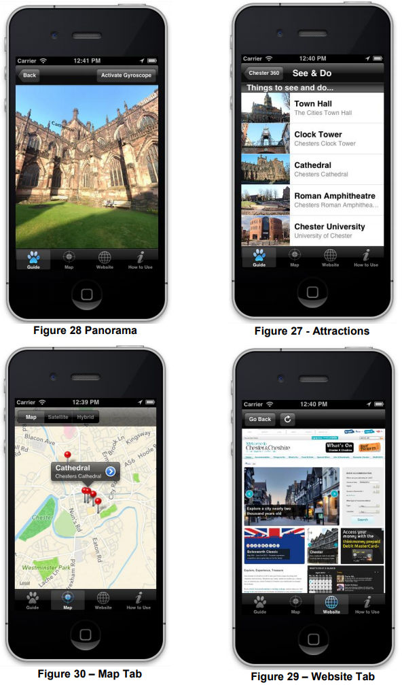

# Chester360

Chester 360 is a iOS iOS application which includes the implementation of a 360° panoramic engine created using native iOS technologies (QuartzCore) and written in objective-c utilising GPS anf gyroscopic sensors. Fundamentally it represents a 'Google street view' style experience developed on the iOS platform around the time google street view itself was being developed.

# Why

It was developed by James Pickup for his computer science dissertation in 2012. It uses a bespoke 3D panoramic engine using the cocoa touch and quartz core framework and evaluated the speed and memory utilisation of such an implementation.

# UI Examples

